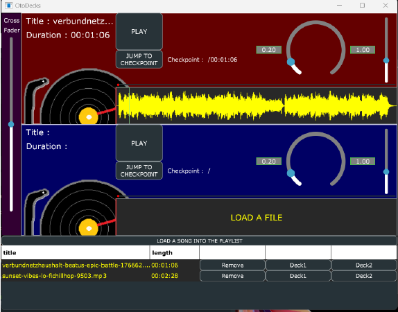

# DJApplication_ObjectOrientedProgramming_2024_UoL

This repository contains the end-of-term assignment for the CM2005 Object Oriented Programming module. The project involves developing a DJ application using the JUCE C++ framework, demonstrating core audio playback functionalities, user interface customization, and the implementation of an advanced DJ feature researched from existing applications.

- Code Origin and Development Approach:

To provide transparency into the development process, the source code contributions are indicated as follows (refer to the "oop codes final that i wrote.pdf" for visual highlighting in the codebase):

    Green Highlight / Authored: Code written entirely by myself, potentially referencing standard JUCE documentation or examples provided within the Coursera learning materials.

    Orange Highlight / Third-Party Reference: Sections where I referred to external third-party sources (e.g., Stack Overflow, JUCE forum discussions) for potential solutions or to understand specific concepts before implementing my own version.

    Red Highlight / External Help: Specific sections where I sought direct help from someone to understand or debug a particular piece of code.

    No Highlight / Course Material: Code or concepts directly derived from the learning materials and examples provided on Coursera for this module.

- DJ Application UI:

- Project Structure & Tasks:

The assignment is broken down into three main tasks:

Task 1: Basic Program Functionality (R1)

    R1A: Load Audio Files:

        Implementation Details: Utilized DeckGUI::filesDropped() for drag-and-drop onto individual decks and PlaylistComponent::filesDropped() / PlaylistComponent::buttonClicked() for playlist interactions. DJAudioPlayer::loadURL() and WaveformDisplay::loadURL() are core to this. DeckGUI::getSongsTime() was implemented to calculate and display song duration. (Primarily Green/Authored and Coursera Material)

    R1B: Play Two or More Tracks:

        Implementation Details: Achieved by instantiating two DeckGUI objects and two DJAudioPlayer objects in MainComponent.h. (Primarily Coursera Material)

    R1C: Mix Tracks by Varying Volumes:

        Implementation Details: The volSlider in DeckGUI uses DJAudioPlayer::setGain() to adjust volume. (Primarily Coursera Material)

    R1D: Speed Up and Slow Down Tracks:

        Implementation Details: The speedSlider in DeckGUI utilizes DJAudioPlayer::setSpeed() which modifies the ResamplingAudioSource ratio. (Primarily Coursera Material)

Task 2: User Interface Customization (R2)

    R2A: Significantly Different GUI Layout:

        Implementation Details:

            Spinning vinyl disk and cue arm graphics drawn in DeckGUI::paint(), animated via DeckGUI::timerCallback(). (Primarily Green/Authored)

            posSlider made transparent and repositioned in DeckGUI's constructor and resized() method. (Primarily Green/Authored)

            Play/Stop toggle button logic implemented in DeckGUI::buttonClicked() using setButtonText(). (Primarily Green/Authored)

            Volume/speed slider styling and default values set in DeckGUI's constructor. (Primarily Green/Authored)

            Color-coding, including dynamic crossfader background, implemented in DeckGUI::paint() and CrossFader::paint(). (Primarily Green/Authored)

    R2B: New Event Listener(s):

        Implementation Details (Checkpoint): repeatSlider and repeatButton added to DeckGUI. Logic for setting and jumping to checkpoint in DeckGUI::buttonClicked() and DeckGUI::sliderValueChanged(). Timestamp conversion and display in DeckGUI::convertToSeconds() and DeckGUI::paint(). (Primarily Green/Authored)

        Implementation Details (Crossfader): See Task 3.

Task 3: Research and Implementation of a New DJ Feature (R3)

    Research: Identified the "Crossfader" from Mixxx.

    Implementation (Crossfader):

        Implementation Details: CrossFader class created (CrossFader.h, CrossFader.cpp).

            Constructor takes DJAudioPlayer and DeckGUI pointers.

            CrossFader::sliderValueChanged() calculates the mix value and applies gain changes to player1 and player2 relative to their volSlider values (currentV1, currentV2) obtained from deckGUI1 and deckGUI2. The mix value is also stored in deckGUI1->CFValue and deckGUI2->CFValue. (Logic for combining CFSlider and volSlider was a key part - primarily Green/Authored, potentially some Orange for general C++/JUCE patterns).

            DeckGUI::sliderValueChanged() for volSlider was updated to multiply its value by the stored CFValue before calling player->setGain(). (Primarily Green/Authored)

            The dynamic background color of the CrossFader component is handled in CrossFader::paint(). (Primarily Green/Authored)

Technologies Used:

    C++

    JUCE Framework (for GUI, audio processing, and application structure)
